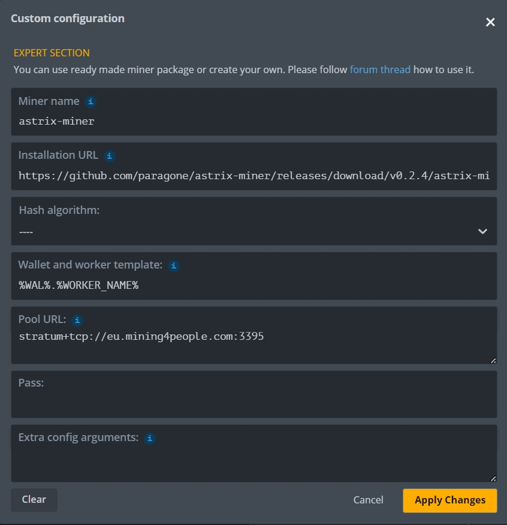

# astrix-miner
astrix gpu miner release
V0.2.4
https://github.com/paragone/astrix-miner/releases/tag/V0.2.2

- dev fee 3% -> 2%
- Efficiency improvements (~10% - 20%)
- fix AMD GPU supports : especially 70 series ！！
- fix stratum protocol，now it‘s smooth

U can use pool url or xx.xx.xx.xx:34150 for solo

## You Guys Should update Nvidia Driver to a newer version if you meet the driver issues

## windows 
```
#this command for solo mining
.\astrix-miner.exe  -a WALLET  -s 127.0.0.1:34150
#this command for pool mining
.\astrix-miner.exe  -a WALLET  -s stratum+tcp://eu.mining4people.com:3395
```
## linux
```
#this command for solo mining
./astrix-miner  -a WALLET -s 127.0.0.1:34150
#this command for pool mining
.\astrix-miner.exe  -a WALLET  -s stratum+tcp://eu.mining4people.com:3395
```
## hiveos
url:
```
https://github.com/paragone/astrix-miner/releases/download/v0.2.4/astrix-miner-0.2.4.tar.gz
```
if u meet the GLIC error,run the command below:
```
echo "deb http://cz.archive.ubuntu.com/ubuntu jammy main" >> /etc/apt/sources.list && apt update && DEBIAN_FRONTEND=noninteractive apt install libc6 -y
```



```
astrix-miner 0.2.4-GPU
A astrix high performance CPU miner

USAGE:
    astrix-miner.exe [OPTIONS] --mining-address <MINING_ADDRESS>

OPTIONS:
    -a, --mining-address <MINING_ADDRESS>
            The astrix address for the miner reward

        --cuda-device <CUDA_DEVICE>
            Which CUDA GPUs to use [default: all]

        --cuda-disable
            Disable cuda workers

        --cuda-no-blocking-sync
            Actively wait for GPU result. Increases CPU usage, but removes delays that might result in red blocks. Can have lower workload.

        --cuda-nonce-gen <CUDA_NONCE_GEN>
            The random method used to generate nonces. Options: (i) xoshiro - each thread in GPU will have its own random state, creating a (pseudo-)independent xoshiro sequence (ii) lean - each GPU will have a single random nonce, and each GPU thread will work on nonce + thread id.

            [default: lean]

        --cuda-workload <CUDA_WORKLOAD>
            Ratio of nonces to GPU possible parrallel run [default: 64]

        --cuda-workload-absolute
            The values given by workload are not ratio, but absolute number of nonces [default: false]

    -d, --debug
            Enable debug logging level

        --devfund-percent <DEVFUND_PERCENT>
            The percentage of blocks to send to the devfund (minimum 2%)

            [default: 2]

        --experimental-amd
            Uses SMID instructions in AMD. Miner will crash if instruction is not supported

    -h, --help
            Print help information

        --mine-when-not-synced
            Mine even when astrixd says it is not synced, only useful when passing `--allow-submit-block-when-not-synced` to astrixd  [default: false]

        --opencl-amd-disable
            Disables AMD mining (does not override opencl-enable)

        --opencl-device <OPENCL_DEVICE>
            Which OpenCL GPUs to use on a specific platform

        --opencl-enable
            Enable opencl, and take all devices of the chosen platform

        --opencl-no-amd-binary
            Disable fetching of precompiled AMD kernel (if exists)

        --opencl-nonce-gen <OPENCL_NONCE_GEN>
            The random method used to generate nonces. Options: (i) xoshiro - each thread in GPU will have its own random state, creating a (pseudo-)independent xoshiro sequence (ii) lean - each GPU will have a single random nonce, and each GPU thread will work on nonce + thread id.

            [default: lean]

        --opencl-platform <OPENCL_PLATFORM>
            Which OpenCL platform to use (limited to one per executable)

        --opencl-workload <OPENCL_WORKLOAD>
            Ratio of nonces to GPU possible parrallel run in OpenCL [default: 512]

        --opencl-workload-absolute
            The values given by workload are not ratio, but absolute number of nonces in OpenCL [default: false]

    -p, --port <PORT>
            astrixd port [default: Mainnet = 34150, Testnet = 16211]

    -s, --astrixd-address <ASTRIXD_ADDRESS>
            The IP of the astrixd instance

            [default: 127.0.0.1]

    -t, --threads <NUM_THREADS>
            Amount of CPU miner threads to launch [default: 0]

        --testnet
            Use testnet instead of mainnet [default: false]

    -V, --version
            Print version information
```
